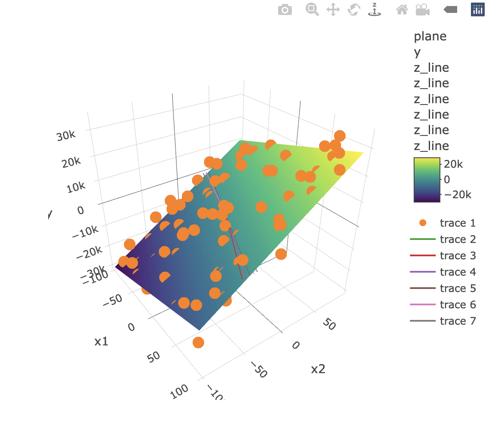

# boundary

## Introduction

The **boundary** package provides tools to estimate and visualize the uncertainty of the decision boundary in a linear regression model. In many applications, you might be interested in the point where the regression line crosses zero—represented by the transformed parameter $-b[1]/b[2]$. This package offers two methods to compute confidence intervals for this value:

-   **Delta Method:** Uses a gradient calculation with a normal approximation.
-   **Lagrange Multipliers Method:** Finds the smallest and largest values of the transformed parameter using a constraint based on the covariance matrix and an F-distribution quantile.

In addition, the package includes functions for data generation, coefficient estimation, and 3D interactive visualization.

## Example

In this example, we generate a linear model with two predictors, simulate data, estimate regression coefficients, compute confidence intervals for the decision boundary (where $y=0$), and visualize the results.

``` r
# Generate true regression coefficients
linear_function <- generate_linear_function()
beta1 <- linear_function$beta1
beta2 <- linear_function$beta2

# Generate random predictor data
points <- generate_random_points(100)
x1 <- points$x1
x2 <- points$x2

# Generate noise and create the response variable
epsilon <- add_random_noise(100, sigma = 5000)
y <- beta1 * x1 + beta2 * x2 + epsilon

# Create design matrix and estimate coefficients
X <- cbind(x1, x2)
b <- estimate_b(X, y)

# Calculate a 95% confidence interval using the delta method
ci_delta <- calculate_confidence_interval_by_delta_method(X, y, b, 0.95)
print(ci_delta)

# Calculate a 95% confidence interval using the Lagrange multipliers method
ci_lagrange <- calculate_confidence_interval_by_langrange_multipliers(X, y, b, 0.95)
print(ci_lagrange)

# Plot the data, regression line (y=0), and the confidence interval lines
plot_data(X, y, b, ci_delta, show_plane = TRUE)
```



We see the points as orange dots and a plane of the linear regression. On $y = 0$, we see lines that represent the confidence band in the decision boundary.
